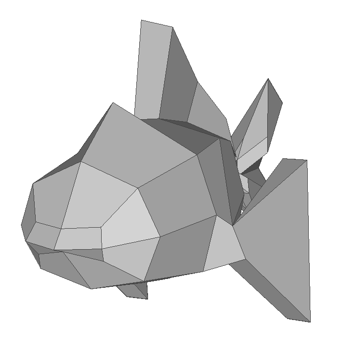
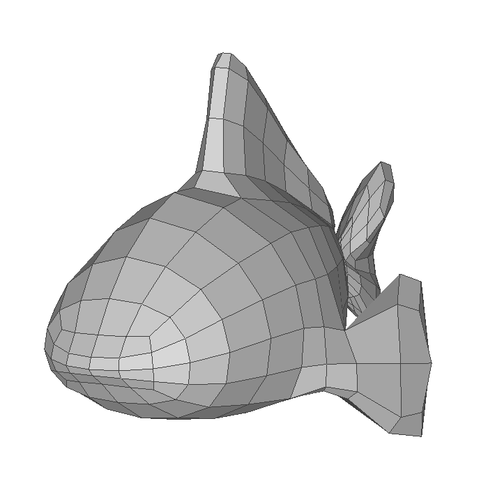
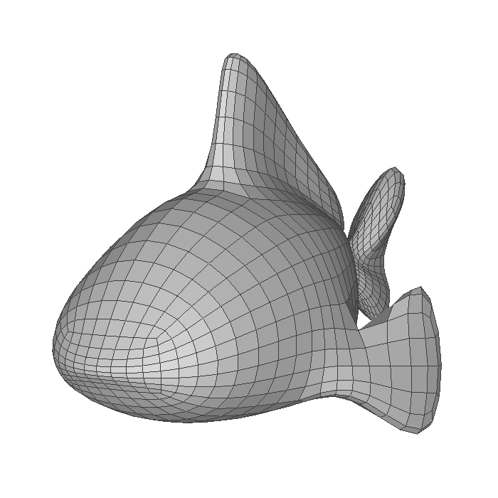
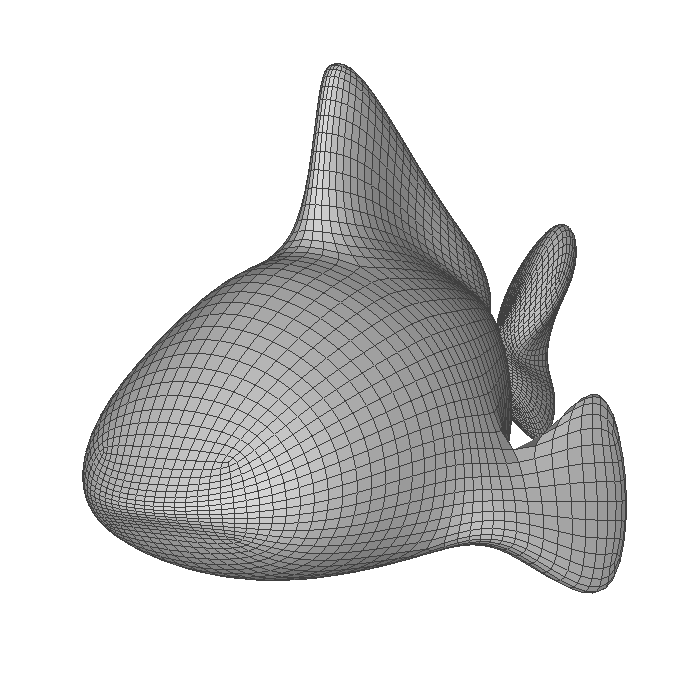
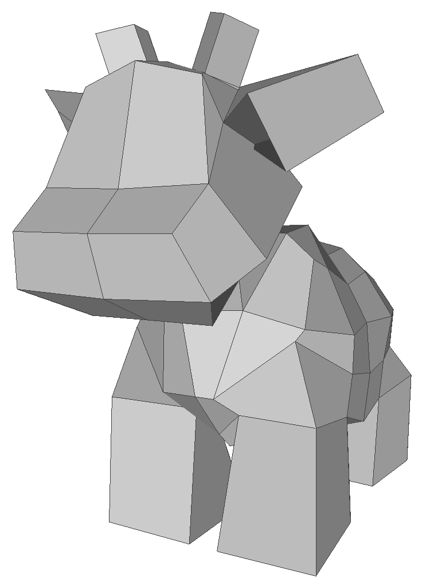
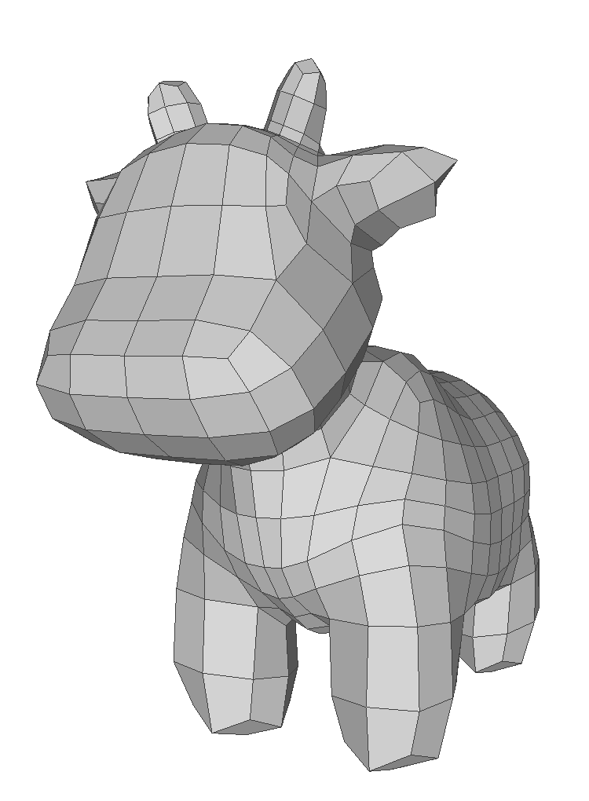
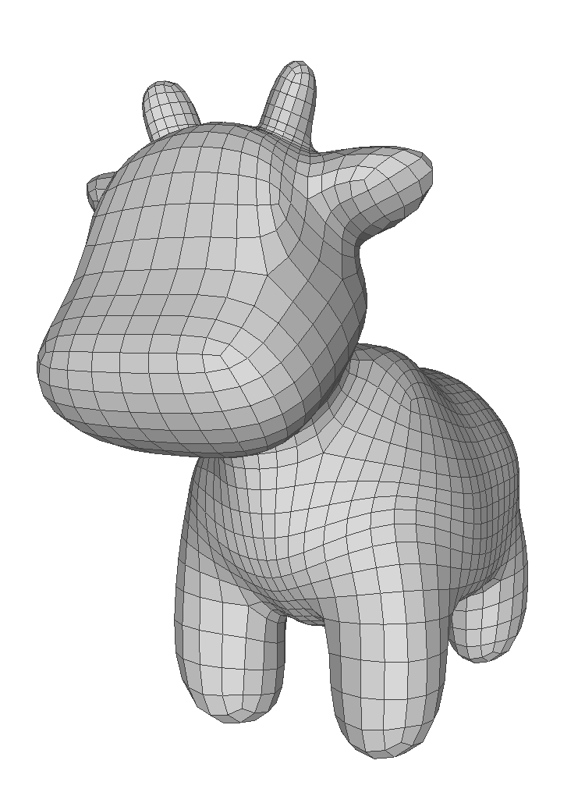
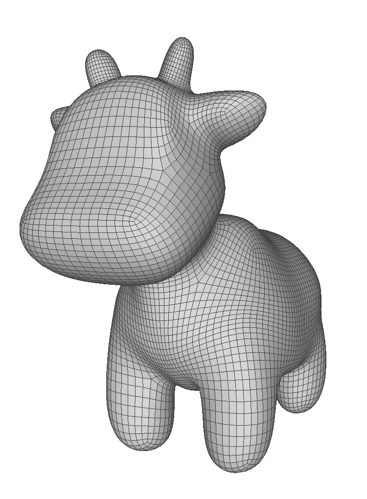

# Catmull-Clark Subdivision Surface

メッシュの細分割曲面として代表的なCatmull-Clark細分割を研究の一環として実装．  
* 使用言語：C++
* 使用ライブラリ：Eigen
### 細分割曲面
* 細分割曲面を表す制御メッシュを細分割すること得られる曲面
* 繰り返し細分割することで滑らかな曲面を近似するメッシュを得ることができる
* 分割操作を無限回繰り返すことで本来の細分割曲面が表現できる
* 精緻化と平滑化の２段階の処理に分けられる
    - 精緻化：新しい頂点を追加し，面を細分する
    - 平滑化：頂点位置を移動させる

### Catmull-Clark 細分割
多角形メッシュを繰り返し細分割し，四角形メッシュの滑らかな曲面に変換する手法
